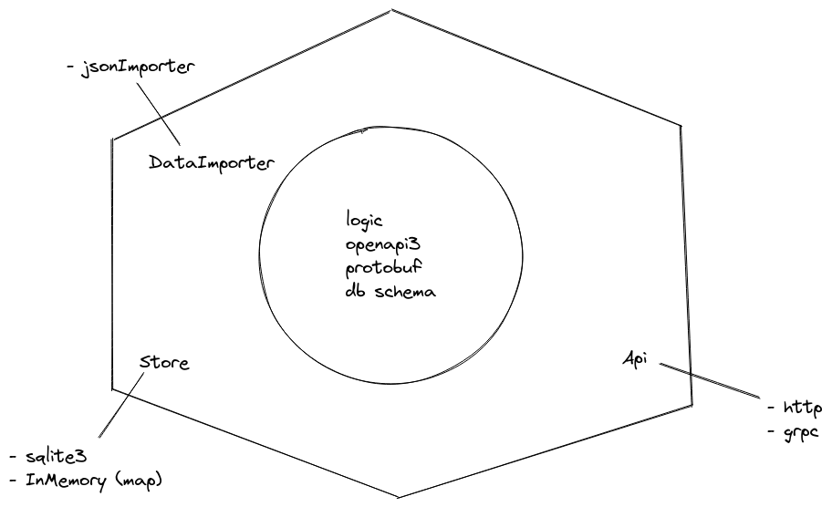

# Seaports service

## Architecture
Hexagonal architecture based.

Used dependency injection to separate implementation (adapters) from interfaces (ports). \
Thanks to this, code is easy to extend with other adapters. \
Another great advantage of this approach is that components can be tested separately.

## Code
Idiomatic approach:
- using `context.Context`, `chan` and `mutex` for synchronization (no sleeping!)
- predefined errors
- `cobra` for CLI 
- `viper` for configuration
- OS signal handling
- stream json deserialization

## Tests proposal
- Unit tests
  - no particular example, expected coverage 80+%
- Integration tests (with actual adapters instead od mocks)
  - positive scenario:
    - create -> update -> update
  - negative scenarios:
    - update nonexisting object
    - create same entity multiple times
    - malformed request body
- e2e tests with http client against service running in container
  - handle multiple tcp connections
  - check if no data races occur when service is under heavy load

## Trade-offs
Given assignment time (2hrs, but I worked a bit longer on it 🙂), I decided to:
- resign implementing unit tests - example unit test is added [seaports_test.go](/internal/domain/services/seaports_test.go). It uses autogenerated mocks (using [mockery](http://github.com/vektra/mockery))
- resign adding docker-compose file
- use in-memory database instead of actual sql db
  - this would require starting another container, preferably in docker-compose or k8s, with db running on it

## Docker execution
1. Build image: `make build`
2. Run container: `docker run -v $(pwd)/assets/ports.json:/data:ro -p3333:3333 seaport-service:latest run --config /data/ports.json`